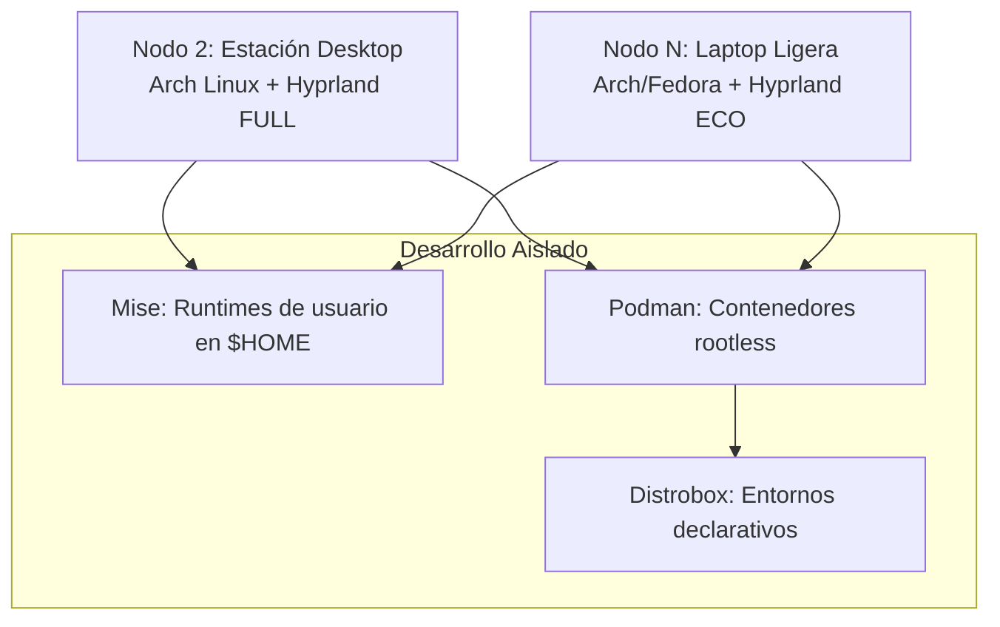

# AGENTS.md — Protocolo de IA, Contexto y Arquitectura

Este archivo es la fuente de verdad y la guía de inducción para cualquier asistente de desarrollo de Inteligencia Artificial (IA) que interactúe con este repositorio.

---

## 1. Protocolo de Interacción y Comunicación (Interaction Protocol)

*   **Comunicación Directa:** Responde siempre directamente a las dudas, preguntas o comentarios del usuario antes de proponer o ejecutar cualquier comando técnico.
*   **Confirmación Explícita:** Antes de modificar cualquier archivo o ejecutar un comando que altere el sistema, explica detalladamente qué archivos serán afectados y por qué. **Espera la confirmación explícita del usuario** (ej. "adelante", "go ahead") antes de proceder.
*   **Commits Convencionales:** Todos los mensajes de commit en Git deben seguir el estándar [Conventional Commits](https://www.conventionalcommits.org/) y escribirse en **inglés** (ej. `feat(provision): ...`, `fix(ui): ...`, `style(gtk): ...`).

---

## 2. Estándares de Ingeniería (Engineering Standards)

*   **Validación de Chezmoi:** Cualquier cambio en las plantillas o archivos fuentes debe validarse usando `chezmoi diff` o comandos de simulación en seco (`--dry-run`) para asegurar que no se rompan las plantillas.
*   **Cambios Atómicos:** Mantener las modificaciones enfocadas. No mezcles configuraciones de herramientas distintas (ej. `zsh` y `hyprland`) en un mismo commit.
*   **Integridad de Plantillas:** Conservar la lógica condicional relacionada con sistemas operativos (`os`), nombres de host (`hostname`) y variables dinámicas en los archivos `.tmpl`.

---

## 3. Arquitectura de Nodos y Filosofía del Repositorio

Este repositorio administra la configuración de una infraestructura multi-nodo personal bajo la premisa de **Host Inmaculado (Clean Host)**.



### Definición de Nodos:
1.  **Nodo 1 (Servidor Central - Debian):** *En pausa por presupuesto.*
2.  **Nodo 2 (Estación de Fuerza / Desktop):** Estación de alto rendimiento. Ejecuta **Arch Linux + Hyprland**. Interfaz fluida con animaciones completas, difuminado y soporte multi-monitor.
3.  **Nodo N (Clientes Ligeros / Laptops):** Interfaces de movilidad ejecutando **Arch o Fedora + Hyprland (ECO Mode)**. Configuración visual plana (sin animaciones ni blur para ahorrar batería), compartiendo el 100% de la lógica gráfica y atajos.

### Filosofía "Clean Host":
El sistema base se mantiene libre de paquetes de desarrollo. Las herramientas se aíslan:
*   **Runtimes (Node/Python/Go):** Gestionados localmente por `Mise` en el `$HOME`.
*   **Entornos de Proyectos/Bases de Datos:** Encapsulados en contenedores gráficos y de terminal usando **Podman + Distrobox**.

---

## 4. Technical Skills (Guía de Referencia para la IA)

Cualquier agente de IA debe dominar y aplicar estos patrones dentro del repositorio:

### A. Estilo de Código en Hyprland (Lua Modular)
La configuración de Hyprland está escrita en **Lua modular** y se importa desde `hyprland.lua`:
```lua
-- require("modules.nombre_modulo")
```
Para inyectar diferencias de hardware, usa las variables de Chezmoi en plantillas `.tmpl`:
```lua
{{- if eq .node.profile "laptop" }}
-- Configuración ECO
{{- else }}
-- Configuración FULL
{{- end }}
```

### B. Contenedores Declarativos con Distrobox
Los contenedores no se crean manualmente. Se declaran en `dot_config/distrobox/distrobox.ini.tmpl`:
```ini
[dev-node]
image=registry.fedoraproject.org/fedora-toolbox:latest
additional_packages="nodejs npm"
```
Se inicializan automáticamente en el apply mediante `distrobox assemble`.

---

## 5. Roadmap y Tareas Activas
Para consultar el plan de implementación detallado y las tareas que se están ejecutando en el turno actual, consulta el archivo:
*   `/home/yordycg/.local/share/chezmoi/docs/tasks.md`
