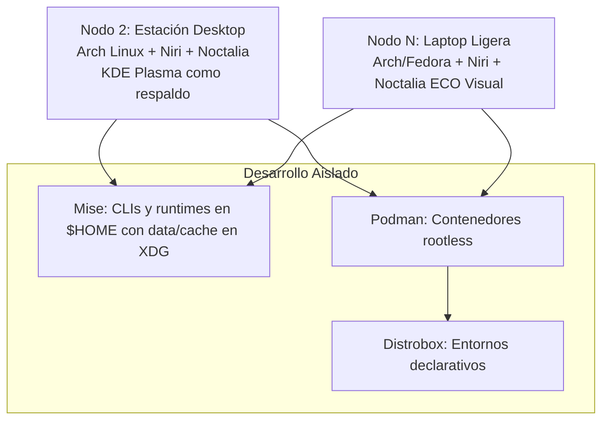

# AGENTS.md — Protocolo de IA, Contexto y Arquitectura

Este archivo es la fuente de verdad y la guía de inducción para cualquier asistente de desarrollo de Inteligencia Artificial (IA) que interactúe con este repositorio.

---

## 1. Protocolo de Interacción y Comunicación (Interaction Protocol)

- **Comunicación Directa:** Responde siempre directamente a las dudas, preguntas o comentarios del usuario antes de proponer o ejecutar cualquier comando técnico.
- **Confirmación Explícita:** Antes de modificar cualquier archivo o ejecutar un comando que altere el sistema, explica detalladamente qué archivos serán afectados y por qué. **Espera la confirmación explícita del usuario** (ej. "adelante", "go ahead") antes de proceder.
- **Planificación Previa (SDD Simplificado):** Para cualquier tarea no trivial, presenta primero un plan de acción detallando la estrategia, qué archivos se verán afectados y cómo se verificará. Espera la validación del plan antes de escribir o modificar código.
- **Commits Convencionales:** Todos los mensajes de commit en Git deben seguir el estándar [Conventional Commits](https://www.conventionalcommits.org/) y escribirse en **inglés** (ej. `feat(provision): ...`, `fix(ui): ...`, `style(gtk): ...`).

---

## 2. Estándares de Ingeniería (Engineering Standards)

- **Validación de Chezmoi:** Cualquier cambio en las plantillas o archivos fuentes debe validarse usando `chezmoi diff` o comandos de simulación en seco (`--dry-run`) para asegurar que no se rompan las plantillas.
- **Cambios Atómicos:** Mantener las modificaciones enfocadas. No mezcles configuraciones de herramientas distintas (ej. `zsh` y `hyprland`) en un mismo commit.
- **Integridad de Plantillas:** Conservar la lógica condicional relacionada con sistemas operativos (`os`), nombres de host (`hostname`) y variables dinámicas en los archivos `.tmpl`.
- **Cero Marcadores de Posición (No Placeholders/TODOs):** El código debe entregarse completamente funcional. No dejes comentarios de tipo `TODO`, `FIXME` ni fragmentos incompletos u omitidos (ej. `// rest of the code...`), a menos que sea explícitamente solicitado.
- **Robustez e Idempotencia:** Todos los scripts de shell y aprovisionamiento deben ser seguros, utilizar `set -euo pipefail` y estar diseñados para poder ejecutarse varias veces sin romper nada. Emplear fallos tolerantes (`run_tolerant`) en pasos secundarios para reportar advertencias en lugar de abortar.

---

## 3. Rol y Filosofía de Desarrollo (Mentor Persona)

- **Enfoque de Mentoría:** Explica de forma concisa el "porqué" de las soluciones adoptadas. Si detectas un enfoque subóptimo, propone mejoras alternativas explicando el beneficio técnico en lugar de solo acatar la instrucción.

---

## 4. Arquitectura de Nodos y Filosofía del Repositorio

Este repositorio administra la configuración de una infraestructura multi-nodo personal bajo la premisa de **Host Inmaculado (Clean Host)**.


```mermaid
graph TD
    Node2[Nodo 2: Estación Desktop<br>Arch Linux + Niri + Noctalia<br>KDE Plasma como respaldo]
    NodeN[Nodo N: Laptop Ligera<br>Arch/Fedora + Niri + Noctalia ECO Visual]

    subgraph Desarrollo Aislado
        Mise[Mise: CLIs y runtimes en $HOME con data/cache en XDG]
        Podman[Podman: Contenedores rootless]
        Distrobox[Distrobox: Entornos declarativos]
    end

    Node2 --> Mise
    Node2 --> Podman
    NodeN --> Mise
    NodeN --> Podman
    Podman --> Distrobox
```

### Definición de Nodos:

1.  **Nodo 1 (Servidor Central - Debian):** _En pausa por presupuesto._
2.  **Nodo 2 (Estación de Fuerza / Desktop):** Estación de alto rendimiento. Ejecuta **Arch Linux + Niri + Noctalia** como flujo principal y **KDE Plasma (sddm)** como escritorio de respaldo. Animaciones completas, sombras profundas y blur activados.
3.  **Nodo N (Clientes Ligeros / Laptops):** Interfaces de movilidad ejecutando **Arch o Fedora + Niri + Noctalia (Modo ECO Visual)**. Configuración gráfica plana (sin animaciones, sombras ni blur para ahorrar ciclos de render en iGPU y batería). Conserva el 100% de la capacidad de cómputo (CPU/RAM libre para múltiples navegadores, IDEs de desarrollo, contenedores y terminales) compartiendo el 100% de la lógica gráfica y atajos.

### Filosofía "Clean Host":

El sistema base se mantiene libre de paquetes de desarrollo. Las herramientas se aíslan:

- **CLIs y runtimes:** Gestionados por `Mise` (mismas versiones cross-distro). La **data/cache** de los runtimes se redirige a XDG (`CARGO_HOME`, `GOPATH`, `NPM_CONFIG_CACHE`, …) desde `exports.sh` + `environment.d` para que `$HOME` no se ensucie.
- **Entornos de Proyectos/Bases de Datos:** Encapsulados en contenedores gráficos y de terminal usando **Podman + Distrobox**.

### Los 2 Pilares de Creación del Usuario:

1. **Pilar 1: Learn (Aprender & Comprender):**
   - **Ámbito:** Repositorios `learning-*`, `ai-learning-path`, `business-acumen`, `emprendimiento`, C, POSIX, Linux kernel y sistemas.
   - **Cadencia Semanal:** Lunes a Viernes (Katas de concepto atómico guiadas por la IA); Sábado (Milestones de integración en `projects/` donde el alumno es 100% autor/arquitecto y la IA sólo reta y revisa); Domingo (Retrospectiva, Zettels y tick semanal).
   - **Interacción:** Tutor Adaptativo (`socratic-mentor`) con Verdades Incondicionales, Descubrimiento Motivado (3B1B), grafo DAG nativo en terminal antes de enseñar, calibración interactiva (`quiz`, `ask_user_question`) e ingesta con `pdf-reader` y `youtube-transcript`.
   - **Invariantes:** Verificación estricta (`-fsanitize=address,undefined` / `just run`), diagnóstico guiado sin cuchara (`code-diagnostic`) y notas atómicas permanentes en Obsidian Zettelkasten (`obsidian-query`).
   - **Autoría de Proyectos:** El estudiante escribe el 100% de la arquitectura, pseudocódigo y docs en `projects/*/docs/` y código en `projects/*/src/`. Prohibido a la IA pre-diseñar o autorar estos documentos.

2. **Pilar 2: Videcoding (Construir & Entregar):**
   - **Ámbito:** Todo proyecto de software nuevo, herramientas y entregables (`new-videcoding-project`).
   - **Interacción:** Orquestación dual Architect + Worker, metodología SDD (Fases 0–7), TDD estricto y seguimiento dual `TASKS.md` ↔ `Project.canvas`.

- **Plataforma Base (Clean Host & Gobernanza):**
  Chezmoi, Mise, contenedores y la tríada de IA (`ai-ecosystem`) constituyen la plataforma transversal inmaculada. No representan un flujo de desarrollo diario, sino el taller sobre el que operan ambos pilares.

---

## 5. Technical Skills (Guía de Referencia para la IA)

Cualquier agente de IA debe dominar y aplicar estos patrones dentro del repositorio:

### A. Estilo de Código en Hyprland (Lua Modular)

La configuración de Hyprland está escrita en **Lua modular** y se importa desde `hyprland.lua`:

```lua
-- require("modules.nombre_modulo")
```

Para inyectar diferencias de hardware, usa las variables de Chezmoi en plantillas `.tmpl`:

```lua
{{- if eq .node.profile "laptop" }}
-- Configuración ECO
{{- else }}
-- Configuración FULL
{{- end }}
```

### B. Contenedores Declarativos con Distrobox

Los contenedores no se crean manualmente. Se declaran en `dot_config/distrobox/distrobox.ini.tmpl`:

```ini
[dev-node]
image=registry.fedoraproject.org/fedora-toolbox:latest
additional_packages="nodejs npm"
```

Se inicializan automáticamente en el apply mediante `distrobox assemble`.

### C. Arquitectura y Paridad de la Tríada de IA (Pi, OpenCode, Antigravity)

El entorno utiliza 3 clientes de IA complementarios que deben mantenerse en **paridad absoluta**:
1. **Pi (`pi`)**: CLI TUI con extensiones en TypeScript (`~/.pi/agent`).
2. **OpenCode (`opencode`)**: TUI interactivo multi-agente (`~/.config/opencode`).
3. **Antigravity (`agy`)**: CLI y orquestador agentic con soporte de subagentes (`~/.gemini`).

#### Reglas de Gobernanza para Agentes:
- **Fuente Única de Reglas Globales:** El archivo maestro de directrices globales reside exclusivamente en `dot_pi/agent/AGENTS.md`. Cualquier actualización debe realizarse allí; `dot_config/opencode/AGENTS.md.tmpl` lo importa automáticamente vía `{{ include }}` y Antigravity lo enlaza simbólicamente a `~/.gemini/config/rules/global.md`. **Nunca duplicar texto de reglas a mano.**
- **Repositorio Único de Skills (`~/.agents/skills/`):** Toda skill creada o modificada debe alojarse en `dot_agents/skills/<nombre>/SKILL.md`. Los 3 agentes consumen esta misma carpeta.
- **Paridad de MCPs:** Cualquier servidor MCP incorporado (ej. `fff-mcp`) debe registrarse en las 3 herramientas:
  - OpenCode: `dot_config/opencode/opencode.jsonc` (sección `mcp`).
  - Pi: `dot_pi/agent/settings.json` (sección `packages`) o extensión local.
  - Antigravity: `agy mcp add <nombre> <comando>`.
- **Modo Plan / Build Obligatorio:** Todo agente debe respetar el ciclo *Plan First* (inspección de solo lectura, preguntas de alineación) antes de desbloquear herramientas de edición en la fase *Build*.

---

## 6. Roadmap y Tareas Activas

Para consultar el plan de implementación detallado y las tareas que se están ejecutando en el turno actual, consulta el archivo:

- `/home/yordycg/.local/share/chezmoi/docs/tasks.md`
