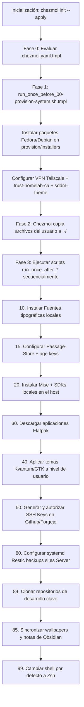

# Blueprint de Arquitectura: dotfiles-universal (Chezmoi)

Este documento detalla la arquitectura técnica, filosofía de diseño, topología de nodos, árbol de directorios y el código fuente completo de los componentes más críticos de la configuración de **chezmoi** en el repositorio `dotfiles-universal`.

El objetivo de este plano es servir como especificación técnica completa para realizar análisis de diseño, auditorías de seguridad y evaluar optimizaciones con otros modelos de IA.

---

## 1. Contexto de Diseño y Filosofía de Operación

### 1.1 Objetivos de Diseño
1. **Zero-Touch absoluto:** La inicialización en un equipo nuevo (`chezmoi init --apply`) debe ejecutarse de forma desatendida, sin prompts interactivos de contraseñas o datos, cargando automáticamente las configuraciones a partir de variables de entorno.
2. **Sudo-less en el día a día:** Las tareas del sistema que requieren privilegios de administrador (`sudo`) se agrupan por separado. Las ejecuciones diarias (`chezmoi apply` o `just apply`) corren al 100% en espacio de usuario ($HOME) sin pedir contraseñas.
3. **Uso de Secretos Basado en Age/Passage:** Migración completa de llaves GPG hacia un sistema ligero basado en `age`. `passage` se emplea como bóveda local de contraseñas.
4. **Enfoque de Sistemas Operativos:** Exclusivo para entornos **Linux** y **WSL** (con bloqueo explícito para Windows nativo).

### 1.2 Topología de Nodos y Roles
* **Nodo 1 (Servidor Central - Headless):** Aloja contenedores persistentes, base de datos y es el receptor de flujos de trabajo de terminal (Tmux + Neovim).
* **Nodo N (Laptops/Desktops - GUI):** Clientes con entornos gráficos (KDE Plasma o Sway). Sus configuraciones visuales (GTK, Qt, Kvantum, fuentes) se aprovisionan de manera condicional.

---

## 2. Estructura de Directorios del Repositorio (`chezmoi/`)

A continuación se detalla la estructura física del repositorio:

```text
/home/yordycg/.local/share/chezmoi/
├── .chezmoi.yaml.tmpl              # Genera dinámicamente la configuración local de chezmoi
├── .chezmoignore                  # Exclusiones dinámicas según variables de entorno (ej: sin GUI)
├── .gitignore                      # Exclusiones de Git
├── Justfile                        # Task runner con comandos (apply, diff, update, save)
├── GEMINI.md                       # Instrucciones internas para agentes
├── context.md                      # Contexto del usuario y entorno de trabajo
│
├── docs/                           # Documentación de arquitectura interna
│   ├── bootstrap-execution-flow.md # Flujo de inicialización detallado paso a paso
│   ├── bootstrap-fixes.md          # Registro post-mortem de corrección de errores
│   ├── deployment-scenarios.md     # Manual de despliegue y planes de contingencia
│   ├── homelab-workflow.md         # Topología de nodos y políticas de terminal
│   ├── project-workflow.md         # Estándar de desarrollo de proyectos (Compose + Just)
│   ├── remote-workflow-guide.md    # Guía de conexión ssh y live-reload a puertos locales
│   └── ssl-trust-architecture.md   # Explicación del PKI Homelab y el bundle de Caddy a Node.js
│
├── dot_config/                     # Configuraciones de usuario (~/.config/*)
│   ├── shell/                      # Scripts de inicialización modulares de Zsh
│   │   ├── aliases.sh
│   │   ├── functions.sh
│   │   ├── exports.sh.tmpl
│   │   └── functions/              # Funciones modulares (git, docker, infra, etc.)
│   ├── kitty/                      # Terminal emulator
│   ├── sway/                       # Tiling Window Manager (para entornos Sway)
│   ├── waybar/                     # Barra de estado de Sway
│   ├── mise/                       # Gestor de entornos de desarrollo (Node, Go, Python, etc.)
│   ├── starship.toml.tmpl          # Prompt de terminal moderno
│   ├── wallust/                    # Generador de paletas de colores dinámicas
│   ├── gtk-3.0/ & gtk-4.0/         # Configuraciones de estilos GTK heredados
│   ├── rofi/                       # Menú lanzador de aplicaciones
│   ├── mako/                       # Gestor de notificaciones de escritorio
│   ├── systemd/user/               # Timers y servicios systemd de usuario (Resty backups)
│   └── homelab/                    # Secretos cifrados del entorno (backup.env, etc.)
│
├── dot_local/                      # Archivos de usuario local (~/.local/*)
│   └── bin/
│       └── executable_theme-switch.tmpl  # Script interactivo de cambio de colores
├── private_dot_ssh/                # Llaves y hosts configurados de forma segura
├── private_dot_gnupg/              # Llavero de GPG heredado
│
├── provision/                      # Aprovisionamiento del sistema (Sudo Space)
│   ├── installers/
│   │   ├── fedora.sh               # Registro e instalación de paquetes RPM de Fedora
│   │   └── debian.sh               # Registro e instalación de paquetes APT de Debian
│   └── system/
│       ├── setup-kde-macos-theme.sh  # Script de personalización estética de KDE Plasma 6
│       ├── setup-sddm-theme.sh     # Script para cambiar la pantalla de inicio (SDDM)
│       ├── setup-tailscale.sh      # Inicialización y autorización de VPN
│       └── trust-homelab-ca.sh     # Instalación de certificados raíz en el almacén de confianza
│
└── .chezmoiscripts/                 # Scripts automáticos ejecutados por chezmoi
    ├── run_once_before_00-provision-system.sh.tmpl  # Orquestador del espacio de administración (sudo)
    ├── run_once_after_10-install-fonts.sh.tmpl       # Descarga e instalación de tipografías
    ├── run_once_after_15-setup-password-store.sh.tmpl # Clonado y vinculación de passage/age
    ├── run_once_after_20-install-mise.sh.tmpl        # Descarga de mise y SDKs de desarrollo
    ├── run_onchange_after_30-install-flatpaks.sh.tmpl# Automatización de aplicaciones Flatpak
    ├── run_onchange_after_40-apply-theme.sh.tmpl     # Aplicación del tema gráfico del usuario
    ├── run_after_50-setup-ssh.sh.tmpl                # Generación e inyección automática de llaves SSH
    ├── run_once_after_80-setup-backup.sh.tmpl        # Carga del demonio de respaldos del Homelab
    ├── run_once_after_84-sync-core-repos.sh.tmpl     # Clonación de repositorios de desarrollo
    ├── run_after_85-sync-assets.sh.tmpl              # Sincronización del Second Brain (Obsidian)
    └── run_once_after_99-change-shell.sh.tmpl        # Cambio de shell por defecto a Zsh
```

---

## 3. Código Fuente de los Componentes Clave

### 3.1 Template de Configuración General: `.chezmoi.yaml.tmpl`
Este archivo evalúa las propiedades de la máquina anfitriona y crea un archivo de configuración de chezmoi limpio e inyecta las variables globales que consumen los demás templates.

```yaml
{{/* ══════════════════════════════════════════════════════════════
     .chezmoi.yaml.tmpl
     REPOSITORIO EXCLUSIVO PARA LINUX (Desktop, Server, WSL)
     ══════════════════════════════════════════════════════════════ */}}

{{- if eq .chezmoi.os "windows" -}}
{{-   fail "Este repositorio es exclusivo para entornos Linux. Usa dotfiles-2024 para Windows." -}}
{{- end -}}

{{/* ── PASO 1: Variables base ────────────────────────────────── */}}
{{- $roleFile := "/etc/chezmoi-role" -}}
{{- $nodeRole := "" -}}
{{- if stat $roleFile -}}
{{-   $nodeRole = include $roleFile | trim -}}
{{- end -}}

{{- $isWSL     := env "WSL_DISTRO_NAME" | not | not -}}
{{- $isServer  := or (eq $nodeRole "server") -}}
{{- $hasBattery := stat "/sys/class/power_supply/BAT0" | not | not -}}
{{- $isLaptop  := and (not $isWSL) (not $isServer) $hasBattery -}}
{{- $isDesktop := and (not $isWSL) (not $isServer) (not $hasBattery) -}}

{{/* ── PASO 2: Variables derivadas ───────────────────────────── */}}
{{- $isNativeLinux := or $isLaptop $isDesktop -}}
{{- $isGUI         := $isNativeLinux -}}
{{- $isHeadless    := or $isServer $isWSL -}}

{{/* ── PASO 2.5: Identificar Entorno Gráfico ────────────────── */}}
{{- $desktopEnv := "none" -}}
{{- if $isGUI -}}
{{-   $desktopEnv = promptStringOnce . "desktopEnv" "Entorno de escritorio (kde, sway, both, gnome, none)" "sway" -}}
{{- end -}}

{{- $hasGUI      := or $isLaptop $isDesktop -}}
{{- $hasDocker   := $isServer -}}
{{- $needsSSHcfg := not $isServer -}}
{{- $needsFonts  := $hasGUI -}}

{{/* ── PASO 3: Identificar llave de Age ──────────────────────── */}}
{{- $keyPath := joinPath .chezmoi.homeDir ".config/age/key.txt" -}}
{{- if not (stat $keyPath) -}}
{{-   $keyPath = joinPath .chezmoi.homeDir ".config/chezmoi/key.txt" -}}
{{- end -}}
{{- $hasKey := stat $keyPath | not | not -}}

{{/* ── OUTPUT YAML ─────────────────────────────────────────────── */}}
{{ if $hasKey -}}
encryption: "age"
age:
  identity: {{ $keyPath | quote }}
  recipient: "age1w93unwnu802h9vkygj2d4dxmu23yghw9kd39thwgc0susmsu7spscwp0wa"
{{- else -}}
# Encryption not configured: age key not found
{{- end }}

data:
  # ── Escenarios ──
  isWSL:     {{ $isWSL }}
  isServer:  {{ $isServer }}
  isLaptop:  {{ $isLaptop }}
  isDesktop: {{ $isDesktop }}
  desktopEnv: {{ $desktopEnv | quote }}
  kdeTheme: "mactahoe"

  # ── Capacidades ──
  hasGUI:      {{ $hasGUI }}
  hasDocker:   {{ $hasDocker }}
  needsSSHcfg: {{ $needsSSHcfg }}
  needsFonts:  {{ $needsFonts }}

  # ── Bitwarden ──
  vault_url: "https://vault.home"

  # ── Semántica ──
  isNativeLinux: {{ $isNativeLinux }}
  isGUI:         {{ $isGUI }}
  isHeadless:    {{ $isHeadless }}

  # ── Metadata ───────────────────────────────────────────────
  os:       {{ .chezmoi.os }}
  hostname: {{ .chezmoi.hostname }}
  fontSizeTerminal: {{ if $isDesktop }}15{{ else }}13{{ end }}

  # ── Identidad ──────────────────────────────────────────────
  gitName:      "yordycg"
  gitEmail:     "yordy.carmona8@gmail.com"
  homelab_ip_ts:   "100.110.207.73"
  homelab_ip_local: "192.168.18.99"
  adguard_ip:      {{ if or $isServer $isWSL }}"100.110.207.73"{{ else }}"192.168.18.99"{{ end }}
```

---

### 3.2 Orquestador de Aprovisionamiento: `.chezmoiscripts/run_once_before_00-provision-system.sh.tmpl`
Este script actúa como puerta de enlace de privilegios. Pide la contraseña de sudo una sola vez, y delega de manera idempotente la configuración de bajo nivel a los instaladores.

```bash
#!/usr/bin/env bash
# =============================================================================
# .chezmoiscripts/run_once_before_00-provision-system.sh.tmpl
# Orquestador de Aprovisionamiento del Sistema (Sudo-Space)
# =============================================================================
# Hashes de dependencias para forzar ejecución en cambios:
# {{ include "provision/installers/fedora.sh" | sha256sum }}
# {{ include "provision/installers/debian.sh" | sha256sum }}
# {{ include "provision/system/trust-homelab-ca.sh" | sha256sum }}
# {{ include "provision/system/setup-sddm-theme.sh" | sha256sum }}
# {{ include "provision/system/setup-tailscale.sh" | sha256sum }}
# {{ include "provision/system/setup-kde-macos-theme.sh" | sha256sum }}
# {{ include "scripts/packages/packages.yaml" | sha256sum }}

set -euo pipefail

# Colores Homelab-Style
GREEN='\033[0;32m'
YELLOW='\033[1;33m'
RED='\033[0;31m'
CYAN='\033[0;36m'
BOLD='\033[1m'
RESET='\033[0m'

log_step() { echo -e "\n${CYAN}${BOLD}▶ $1${RESET}"; }
log_ok()   { echo -e "${GREEN}  ✓ $1${RESET}"; }
log_info() { echo -e "${CYAN}  → $1${RESET}"; }
log_warn() { echo -e "${YELLOW}  ⚠ $1${RESET}"; }
log_err()  { echo -e "${RED}  ✗ $1${RESET}"; exit 1; }

# Exportar variables de contexto para los scripts hijos
export NODE_HAS_GUI="{{ .hasGUI }}"
export NODE_IS_SERVER="{{ .isServer }}"
export NODE_IS_WSL="{{ .isWSL }}"
export NODE_DESKTOP_ENV="{{ .desktopEnv }}"
export HOMELAB_IP_LOCAL="{{ .homelab_ip_local }}"
export HOMELAB_IP_TS="{{ .homelab_ip_ts }}"

PROVISION_DIR="{{ .chezmoi.sourceDir }}/provision"

# Solicitar contraseña de sudo al inicio para toda la sesión
log_step "Iniciando Aprovisionamiento del Sistema (Sudo-Space)"
log_info "Esta fase requiere permisos de administrador. Por favor introduce tu contraseña:"
sudo -v

# Mantener sudo activo en segundo plano mientras corre el script
while true; do sudo -n true; sleep 60; kill -0 "$$" || exit; done 2>/dev/null &

# 1. Ejecutar instalación de paquetes del sistema
log_step "1/4. Instalando paquetes del sistema..."
if [ -f /etc/fedora-release ]; then
    bash "$PROVISION_DIR/installers/fedora.sh"
elif [ -f /etc/debian_version ]; then
    bash "$PROVISION_DIR/installers/debian.sh"
else
    log_warn "Distribución no soportada oficialmente para auto-instalación de paquetes."
fi

# 2. Configurar Tailscale
log_step "2/4. Configurando Tailscale VPN..."
bash "$PROVISION_DIR/system/setup-tailscale.sh"

# 3. Confianza SSL (Homelab PKI)
log_step "3/4. Configurando Confianza SSL (Homelab PKI)..."
bash "$PROVISION_DIR/system/trust-homelab-ca.sh"

# 4. Configurar temas de sistema (SDDM, etc.) si tiene GUI
if [ "$NODE_HAS_GUI" = "true" ]; then
    log_step "4/4. Configurando temas gráficos del sistema..."
    bash "$PROVISION_DIR/system/setup-sddm-theme.sh"

    # Configurar tema macOS para KDE si aplica
    {{- if or (eq .desktopEnv "kde") (eq .desktopEnv "both") }}
    log_info "→ Configurando tema macOS ({{ .kdeTheme }}) para KDE..."
    bash "$PROVISION_DIR/system/setup-kde-macos-theme.sh" "{{ .kdeTheme }}"

    if command -v flatpak &>/dev/null; then
        log_info "→ Aplicando overrides sudo para Flatpak (acceso a temas GTK)..."
        sudo flatpak override --filesystem=xdg-config/gtk-3.0 || true
        sudo flatpak override --filesystem=xdg-config/gtk-4.0 || true
    fi
    {{- end }}
else
    log_step "4/4. Sistema Headless (sin GUI), saltando SDDM theme."
fi

log_ok "Aprovisionamiento del sistema completado con éxito."
```

---

### 3.3 Instalador de Paquetes Fedora: `provision/installers/fedora.sh`
Este script analiza y lee del catálogo YAML centralizado de paquetes (`packages.yaml`) utilizando `yq` e instala los paquetes necesarios según el perfil de hardware del nodo y entorno gráfico.

```bash
#!/usr/bin/env bash
# =============================================================================
# provision/installers/fedora.sh
# Instalador de Paquetes para Fedora (DNF)
# =============================================================================
set -euo pipefail

# Colores Homelab-Style
GREEN='\033[0;32m'
YELLOW='\033[1;33m'
RED='\033[0;31m'
CYAN='\033[0;36m'
BOLD='\033[1m'
RESET='\033[0m'

log_ok()   { echo -e "${GREEN}  ✓ $1${RESET}"; }
log_info() { echo -e "${CYAN}  → $1${RESET}"; }
log_warn() { echo -e "${YELLOW}  ⚠ $1${RESET}"; }
log_err()  { echo -e "${RED}  ✗ $1${RESET}"; exit 1; }

SCRIPT_DIR="$(cd "$(dirname "${BASH_SOURCE[0]}")" && pwd)"
PACKAGES_FILE="$SCRIPT_DIR/../../scripts/packages/packages.yaml"

# ── 1. Dependencias del Aprovisionador ────────────────────────────────────────
if ! command -v yq &>/dev/null; then
    log_info "Instalando yq (Procesador YAML)..."
    sudo dnf install -y -q yq
    log_ok "yq instalado."
fi

# ── 2. Función de Instalación por Sección ────────────────────────────────────
install_section() {
    local section="$1"
    log_info "Instalando sección Fedora: $section"
    
    local packages
    packages=$(yq e ".fedora.${section}[]" "$PACKAGES_FILE" 2>/dev/null || echo "")
    
    if [ -z "$packages" ]; then
        log_info "Sección $section vacía, omitiendo."
        return
    fi
    
    sudo dnf install -y -q --skip-unavailable --allowerasing $packages
    log_ok "Paquetes de $section instalados."
}

# ── 3. Ejecución de Perfiles ─────────────────────────────────────────────────
# Perfil Core (Siempre)
install_section "core"

# Perfil Server (Si aplica)
if [ "${NODE_IS_SERVER:-}" = "true" ]; then
    install_section "server"
fi

# Perfil Desktop (Si aplica)
if [ "${NODE_HAS_GUI:-}" = "true" ]; then
    # Habilitar RPM Fusion si no está activo (necesario para codecs multimedia)
    if ! dnf repolist 2>/dev/null | grep -q "rpmfusion-free"; then
        log_info "Habilitando repositorio de RPM Fusion..."
        sudo dnf install -y -q \
            "https://download1.rpmfusion.org/free/fedora/rpmfusion-free-release-$(rpm -E %fedora).noarch.rpm" \
            "https://download1.rpmfusion.org/nonfree/fedora/rpmfusion-nonfree-release-$(rpm -E %fedora).noarch.rpm"
    fi

    # Habilitar repositorio de Google Chrome (Standard Fedora)
    if ! dnf repolist | grep -q "google-chrome"; then
        log_info "Configurando repositorio de Google Chrome..."
        sudo dnf install -y -q fedora-workstation-repositories
        # Compatibilidad con DNF5 (Fedora 41+)
        sudo dnf config-manager setopt google-chrome.enabled=1
    fi

    # Habilitar repositorio de VS Code (Microsoft)
    if ! dnf repolist | grep -q "code"; then
        log_info "Configurando repositorio de VS Code..."
        sudo rpm --import https://packages.microsoft.com/keys/microsoft.asc
        sudo sh -c 'echo -e "[code]\nname=Visual Studio Code\nbaseurl=https://packages.microsoft.com/yumrepos/vscode\nenabled=1\ngpgcheck=1\ngpgkey=https://packages.microsoft.com/keys/microsoft.asc" > /etc/yum.repos.d/vscode.repo'
    fi

    # Habilitar COPR para nwg-look y herramientas de Sway modernas
    if ! dnf copr list | grep -q "tofik/nwg-shell"; then
        log_info "Habilitando COPR tofik/nwg-shell (para nwg-look)..."
        sudo dnf copr enable -y tofik/nwg-shell
    fi

    # Habilitar COPR solopasha/hyprland para swww y waypaper
    if ! dnf copr list | grep -q "solopasha/hyprland"; then
        log_info "Habilitando COPR solopasha/hyprland (swww + waypaper)..."
        sudo dnf copr enable -y solopasha/hyprland
    fi

    # Habilitar COPR atim/xpadneo para driver de controles Xbox One
    if ! dnf copr list | grep -q "atim/xpadneo"; then
        log_info "Habilitando COPR atim/xpadneo (driver Xbox)..."
        sudo dnf copr enable -y atim/xpadneo
    fi

    install_section "desktop"
    
    # Perfil de Entorno Gráfico Específico (Sway, KDE o Ambos)
    if [ "${NODE_DESKTOP_ENV:-}" = "sway" ]; then
        install_section "sway"
    elif [ "${NODE_DESKTOP_ENV:-}" = "kde" ]; then
        install_section "kde"
    elif [ "${NODE_DESKTOP_ENV:-}" = "both" ]; then
        install_section "sway"
        install_section "kde"
    fi

    # Activar servicios instalados condicionalmente
    if systemctl list-unit-files cups.service &>/dev/null; then
        log_info "Habilitando servicio de impresión (CUPS)..."
        sudo systemctl enable --now cups &>/dev/null || true
    fi
    if systemctl list-unit-files bluetooth.service &>/dev/null; then
        log_info "Habilitando servicio de Bluetooth..."
        sudo systemctl enable --now bluetooth &>/dev/null || true
    fi
fi

# Instalar distrobox en clientes (WSL, PC, Laptop)
if [ "${NODE_IS_SERVER:-}" != "true" ]; then
    log_info "Instalando herramientas de desarrollo aislado (distrobox)..."
    sudo dnf install -y -q --skip-unavailable distrobox
fi

log_ok "Aprovisionamiento de paquetes Fedora completado."
```

---

### 3.4 Catálogo de Paquetes Centralizado: `scripts/packages/packages.yaml`
```yaml
fedora:
  core:
    - tailscale
    - age
    - tmux
    - git
    - curl
    - wget
    - gnupg2
    - pinentry
    - zsh
    - gh
    - jq
    - gcc
    - gcc-c++
    - make
    - openssl-devel
    - zlib-devel
    - bzip2-devel
    - readline-devel
    - sqlite-devel
    - llvm-devel
    - ncurses-devel
    - xz-devel
    - libffi-devel
    - unzip
    - sqlite
    - fzf
    - mosh
  desktop:
    - distrobox
    - podman
    - flatpak
    - ostree
    - appstream-compose
    - gnome-disk-utility
    - fontconfig
    - google-chrome-stable
    - code
    - gnome-keyring
    - libsecret
    - nwg-look
    - qt5ct
    - qt6ct
    - kvantum
    - qt5-qtstyleplugins
    - qt6-qtdeclarative
    - qt6-qtsvg
    - qt6-qtquickcontrols2
    - qt6-qt5compat
    - qt6-qtvirtualkeyboard
    - qt6-qtmultimedia
    - kitty
  sway:
    - waybar
    - rofi-wayland
    - cliphist
    - mate-polkit
    - ImageMagick
    - mako
    - imv
    - grim
    - slurp
    - wl-clipboard
    - brightnessctl
    - pavucontrol
    - nm-connection-editor
    - blueman
    - pulseaudio-utils
    - papirus-icon-theme
    - gammastep
    - kanshi
    - swayidle
    - swaylock
    - swww
    - waypaper
  kde:
    - plasma-desktop
    - plasma-workspace
    - plasma-nm
    - plasma-pa
    - powerdevil
    - kscreen
    - bluedevil
    - kde-gtk-config
    - qt5ct
    - konsole
    - dolphin
    - spectacle
    - ark
    - gwenview
    - okular
    - kate
    - kcalc
    - plasma-systemmonitor
    - plasma-discover
    - korganizer
    - sassc
    - glib2-devel
    - ImageMagick
    - dialog
    - optipng
    - inkscape
    - blueman
    - gvfs-mtp
    - libmtp
    - gamemode
    - xpadneo
    - cups
    - system-config-printer
    - ffmpeg
    - ffmpeg-libs
    - gstreamer1-plugins-bad-free
    - gstreamer1-plugins-good
    - gstreamer1-plugins-base
    - gstreamer1-plugin-openh264
    - gstreamer1-libav
    - adobe-source-code-pro-fonts
    - google-noto-sans-fonts
    - google-noto-color-emoji-fonts
```

---

### 3.5 Personalización Automatizada de KDE: `provision/system/setup-kde-macos-theme.sh`
Este script se encarga del clonado idempotente de repositorios de personalización de Vinceliuice, construyendo y compilando los temas para finalmente aplicar la configuración visual usando herramientas oficiales del sistema como `lookandfeeltool` y `kwriteconfig6`.

```bash
#!/usr/bin/env bash
# =============================================================================
# provision/system/setup-kde-macos-theme.sh
# Instala y configura el stack completo de theming macOS para KDE Plasma 6.
# Diseñado para integrarse con el orquestador run_once_before_00-provision-system.sh.tmpl
# =============================================================================
set -euo pipefail

THEME_NAME="${1:-mactahoe}"
FORCE_REINSTALL="${2:-}"

# Normalizar nombre
THEME_LOWER=$(echo "$THEME_NAME" | tr '[:upper:]' '[:lower:]')

# Valores por defecto (mactahoe)
GTK_REPO_NAME="MacTahoe-gtk-theme"
GTK_REPO_URL="https://github.com/vinceliuice/MacTahoe-gtk-theme.git"
ICON_REPO_NAME="MacTahoe-icon-theme"
ICON_REPO_URL="https://github.com/vinceliuice/MacTahoe-icon-theme.git"
GTK_THEME_APPLY="MacTahoe-Dark"
ICON_THEME_APPLY="MacTahoe"

# Mapear otros temas
if [[ "$THEME_LOWER" == "whitesur" ]]; then
    GTK_REPO_NAME="WhiteSur-gtk-theme"
    GTK_REPO_URL="https://github.com/vinceliuice/WhiteSur-gtk-theme.git"
    ICON_REPO_NAME="WhiteSur-icon-theme"
    ICON_REPO_URL="https://github.com/vinceliuice/WhiteSur-icon-theme.git"
    GTK_THEME_APPLY="WhiteSur-Dark"
    ICON_THEME_APPLY="WhiteSur"
elif [[ "$THEME_LOWER" == "mojave" ]]; then
    GTK_REPO_NAME="Mojave-gtk-theme"
    GTK_REPO_URL="https://github.com/vinceliuice/Mojave-gtk-theme.git"
    ICON_REPO_NAME="Mojave-CT-icon-theme"
    ICON_REPO_URL="https://github.com/vinceliuice/Mojave-CT-icon-theme.git"
    GTK_THEME_APPLY="Mojave-Dark"
    ICON_THEME_APPLY="Mojave-CT"
fi

THEME_REPOS_DIR="${XDG_CACHE_HOME:-$HOME/.cache}/kde-macos-themes"
THEMES_DIR="${XDG_DATA_HOME:-$HOME/.local/share}/themes"
ICONS_DIR="${XDG_DATA_HOME:-$HOME/.local/share}/icons"
FONTS_DIR="${XDG_DATA_HOME:-$HOME/.local/share}/fonts"

declare -A REPOS=(
    ["WhiteSur-kde"]="https://github.com/vinceliuice/WhiteSur-kde.git"
    ["WhiteSur-cursors"]="https://github.com/vinceliuice/WhiteSur-cursors.git"
    ["San-Francisco-Pro-Fonts"]="https://github.com/sahibjotsaggu/San-Francisco-Pro-Fonts.git"
)

INSTALL_STAMPS_DIR="${XDG_CACHE_HOME:-$HOME/.cache}/kde-macos-themes/.stamps"

RED='\033[0;31m'
GREEN='\033[0;32m'
YELLOW='\033[1;33m'
BLUE='\033[0;34m'
CYAN='\033[0;36m'
BOLD='\033[1m'
RESET='\033[0m'

log_info()    { echo -e "${BLUE}[INFO]${RESET}  $*"; }
log_ok()      { echo -e "${GREEN}[OK]${RESET}    $*"; }
log_warn()    { echo -e "${YELLOW}[WARN]${RESET}  $*"; }
log_error()   { echo -e "${RED}[ERROR]${RESET} $*" >&2; }
log_section() { echo -e "\n${BOLD}${CYAN}══════════════════════════════════════${RESET}"; \
                echo -e "  $*"; \
                echo -e "${BOLD}${CYAN}══════════════════════════════════════${RESET}"; }

has_cmd() { command -v "$1" &>/dev/null; }

stamp_done() {
    mkdir -p "$INSTALL_STAMPS_DIR"
    touch "$INSTALL_STAMPS_DIR/$1"
}

is_done() {
    [[ "$FORCE_REINSTALL" == "--force" ]] && return 1
    [[ -f "$INSTALL_STAMPS_DIR/$1" ]]
}

clone_or_update() {
    local name="$1"
    local url="$2"
    local dest="$THEME_REPOS_DIR/$name"

    if [[ -d "$dest/.git" ]]; then
        log_info "$name ya clonado — actualizando..."
        git -C "$dest" pull --ff-only --quiet || log_warn "git pull falló en $name, continuando..."
    else
        log_info "Clonando $name..."
        git clone --depth=1 "$url" "$dest" --quiet
        log_ok "$name clonado en $dest"
    fi
}

check_deps() {
    local missing=()
    for dep in git sassc glib-compile-schemas; do
        has_cmd "$dep" || missing+=("$dep")
    done
    if [[ ${#missing[@]} -gt 0 ]]; then
        log_error "Dependencias faltantes: ${missing[*]}"
        exit 1
    fi
}

install_gtk_theme() {
    log_section "GTK Theme: $GTK_REPO_NAME"
    is_done "gtk-theme-$THEME_LOWER" && return 0
    clone_or_update "$GTK_REPO_NAME" "$GTK_REPO_URL"
    local repo="$THEME_REPOS_DIR/$GTK_REPO_NAME"
    if [[ -f "$repo/libs/lib-core.sh" ]]; then
        sed -i 's/GNOME_VERSION="48-0"/GNOME_VERSION="48-0"\n  SHELL_VERSION="48"/g' "$repo/libs/lib-core.sh"
    fi
    bash "$repo/install.sh" --dest "$THEMES_DIR" --color dark --color light --libadwaita --round 2>&1 | sed 's/^/  /'
    stamp_done "gtk-theme-$THEME_LOWER"
}

install_icon_theme() {
    log_section "Icon Theme: $ICON_REPO_NAME"
    is_done "icon-theme-$THEME_LOWER" && return 0
    clone_or_update "$ICON_REPO_NAME" "$ICON_REPO_URL"
    local repo="$THEME_REPOS_DIR/$ICON_REPO_NAME"
    bash "$repo/install.sh" --dest "$ICONS_DIR" 2>&1 | sed 's/^/  /'
    stamp_done "icon-theme-$THEME_LOWER"
}

install_whitesur_kde() {
    log_section "WhiteSur KDE / Kvantum Theme"
    is_done "whitesur-kde" && return 0
    clone_or_update "WhiteSur-kde" "${REPOS[WhiteSur-kde]}"
    local repo="$THEME_REPOS_DIR/WhiteSur-kde"
    bash "$repo/install.sh" 2>&1 | sed 's/^/  /'
    stamp_done "whitesur-kde"
}

install_whitesur_cursors() {
    log_section "WhiteSur Cursors"
    is_done "whitesur-cursors" && return 0
    clone_or_update "WhiteSur-cursors" "${REPOS[WhiteSur-cursors]}"
    local repo="$THEME_REPOS_DIR/WhiteSur-cursors"
    bash "$repo/install.sh" --dest "$ICONS_DIR" 2>&1 | sed 's/^/  /'
    stamp_done "whitesur-cursors"
}

install_sf_fonts() {
    log_section "Fuentes San Francisco Pro (macOS)"
    is_done "sf-fonts" && return 0
    clone_or_update "San-Francisco-Pro-Fonts" "${REPOS[San-Francisco-Pro-Fonts]}"
    local repo="$THEME_REPOS_DIR/San-Francisco-Pro-Fonts"
    local font_dest="$FONTS_DIR/SanFranciscoPro"
    mkdir -p "$font_dest"
    cp "$repo"/*.otf "$font_dest/" 2>/dev/null || true
    cp "$repo"/*.ttf "$font_dest/" 2>/dev/null || true
    fc-cache -f "$font_dest" 2>/dev/null || fc-cache -fv &>/dev/null
    stamp_done "sf-fonts"
}

fix_flatpak_themes() {
    log_section "Fix Flatpak → $GTK_REPO_NAME"
    is_done "flatpak-fix-$THEME_LOWER" && return 0
    if has_cmd flatpak; then
        local repo="$THEME_REPOS_DIR/$GTK_REPO_NAME"
        if [[ -d "$repo" ]]; then
            bash "$repo/tweaks.sh" --flatpak --color dark 2>&1 | sed 's/^/  /' || true
        fi
    fi
    stamp_done "flatpak-fix-$THEME_LOWER"
}

install_firefox_theme() {
    log_section "Tema Firefox ($GTK_REPO_NAME)"
    is_done "firefox-theme-$THEME_LOWER" && return 0
    local repo="$THEME_REPOS_DIR/$GTK_REPO_NAME"
    if [[ ! -d "$repo" ]]; then return 0; fi
    if ! has_cmd firefox && ! flatpak list 2>/dev/null | grep -q "firefox"; then return 0; fi
    bash "$repo/tweaks.sh" --firefox --edit-firefox 2>&1 | sed 's/^/  /' || true
    stamp_done "firefox-theme-$THEME_LOWER"
}

apply_kde_settings() {
    log_section "Aplicar configuración KDE via gsettings / kwriteconfig / lookandfeeltool"
    is_done "kde-settings-$THEME_LOWER" && return 0

    # 1. Aplicar Tema Global de KDE (LookAndFeel)
    if has_cmd lookandfeeltool; then
        local global_theme="com.github.vinceliuice.WhiteSur-dark"
        if [[ "$THEME_LOWER" == "whitesur" ]] || [[ "$THEME_LOWER" == "mactahoe" ]] || [[ "$THEME_LOWER" == "mojave" ]]; then
            global_theme="com.github.vinceliuice.WhiteSur-dark"
        fi
        log_info "Aplicando tema global de KDE ($global_theme)..."
        lookandfeeltool -a "$global_theme" 2>/dev/null || log_warn "Fallo aplicando tema global"
    fi

    if has_cmd gsettings; then
        gsettings set org.gnome.desktop.interface gtk-theme  "$GTK_THEME_APPLY"   2>/dev/null || true
        gsettings set org.gnome.desktop.interface icon-theme "$ICON_THEME_APPLY"  2>/dev/null || true
        gsettings set org.gnome.desktop.interface cursor-theme "WhiteSur-cursors" 2>/dev/null || true
    fi

    if has_cmd kwriteconfig5; then
        kwriteconfig5 --file kdeglobals --group KDE --key widgetStyle "kvantum"
    elif has_cmd kwriteconfig6; then
        kwriteconfig6 --file kdeglobals --group KDE --key widgetStyle "kvantum"
    fi

    if has_cmd kvantummanager; then
        kvantummanager --set WhiteSur 2>/dev/null || true
    fi
    stamp_done "kde-settings-$THEME_LOWER"
}

main() {
    mkdir -p "$THEME_REPOS_DIR" "$THEMES_DIR" "$ICONS_DIR" "$FONTS_DIR"
    check_deps
    install_gtk_theme
    install_icon_theme
    install_whitesur_kde
    install_whitesur_cursors
    install_sf_fonts
    fix_flatpak_themes
    install_firefox_theme
    apply_kde_settings
}

main "$@"
```

---

## 4. Flujo de Ejecución Detallado (Bootstrap a Post-Instalación)

Cuando un nodo limpio arranca, chezmoi sigue una secuencia estricta basada en hashes y dependencias para garantizar el despliegue Zero-Touch:



### Notas Importantes de Ejecución en la Fase 3:
1. **Paso 15 (`setup-password-store`):** Enlaza la llave privada de `age` (`~/.config/age/key.txt`) con la identidad de `passage` (`~/.passage/identities`), clonando el almacén privado de contraseñas de manera desatendida.
2. **Paso 20 (`install-mise`):** Usa `passage` de manera no interactiva para extraer el token secreto de la API de GitHub e instalar los SDKs (Node.js, Go, Python) directamente en el host evitando restricciones de la API.
3. **Paso 50 (`setup-ssh`):** Crea las llaves SSH locales y las inyecta vía API en GitHub y Forgejo usando los tokens recuperados desde la bóveda de contraseñas de `passage`.
