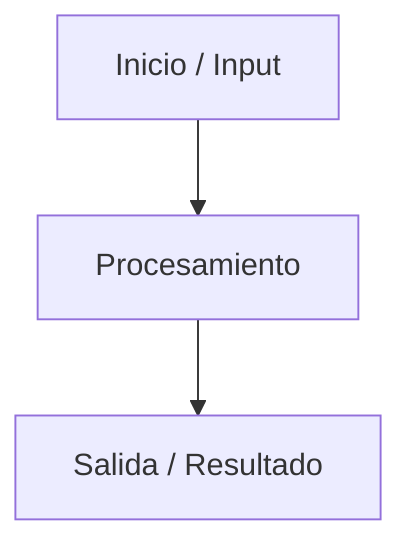

# Fase 3 — Arquitectura y Modelado

> Nota: Utiliza bloques de Mermaid (````mermaid ... ````) o imágenes en `docs/diagrams/`.

## Diagrama de Flujo / Proceso



## Modelo de Datos / DER (si aplica)

| Tabla / Entidad | Campos | Relaciones |
|---|---|---|
| | | |

## Diagrama de Casos de Uso / Actores

- **Actor:**
  - **Acción:**

## Módulos y Servicios necesarios

-

## Preguntas clave — respuestas

1. ¿Cómo viaja la información desde el origen hasta el destino?
2. ¿Dónde se almacenará la información y qué estructura tiene?
3. ¿Qué módulos o librerías independientes necesito para armar esta solución?
